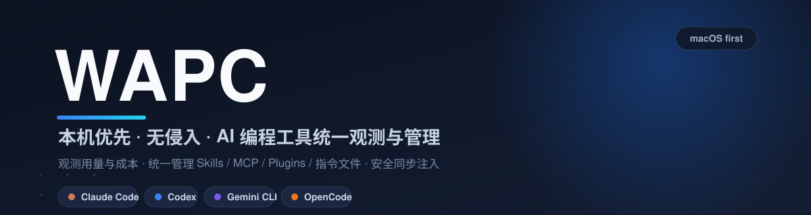

<div align="center">



<br/>

**一个界面,看清并掌控你本机所有 AI 编程工具。**

用量、成本、项目归因,加上 Skills / MCP / Plugins / 指令文件的统一管理与安全同步 —— 全部本机完成,不上传、不侵入、可审计。

[](LICENSE)
[](#-快速开始)
[](https://www.rust-lang.org/)
[](https://tauri.app/)
[](#-参与贡献)

[能力](#-核心能力) · [为什么是-wapc](#-为什么是-wapc) · [对比-cc-switch](#-对比-cc-switch) · [隐私](#-隐私是底座不是补丁) · [快速开始](#-快速开始) · [路线图](#-路线图)

</div>

---

## 你的 AI 工具链,正在失控

你可能同时在用 Claude Code、Codex、Gemini CLI、OpenCode,还有 Cursor、Trae、Kiro 这些 IDE。它们都很强 —— 但合在一起就是一团乱:

- 💸 **花了多少不知道** —— token 和成本散落在每个工具各自的文件里,没人帮你算总账。
- 🧩 **配置各自为政** —— 同一个 MCP、同一份指令文件,在每个工具里格式都不一样,手动同步极易出错。
- 🕳️ **看不见、不可控** —— 本机到底装了哪些工具、哪些 Skills/Plugins、归到哪些项目,全凭记忆。

**WAPC 把这一切收进一个 macOS 桌面应用。** 它旁路读取这些工具已经写在本机的文件,帮你一站式完成:**看清用量与成本**、**统一管理资源**、**安全同步注入** —— 不替换命令、不装代理;只有你在预览 diff 后明确确认的管理动作,才会按备份、原子写、校验、回滚链路修改目标工具文件。

> [!NOTE]
> WAPC 目前处于早期阶段,macOS 优先。核心用 Rust 实现,桌面端基于 Tauri + React。如果这正是你想要的工具,欢迎 ⭐ Star、提 Issue、发 PR,一起把它做成本机 AI 工具的「控制中心」。

## ✨ 核心能力

| | 能力 | 它帮你做什么 |
| --- | --- | --- |
| 📊 | **用量观测台** | 按工具、项目、日期、模型聚合 token、会话与预估成本,带近 7 日趋势 —— 一眼看清钱花在哪。 |
| 🔍 | **工具自动识别** | 扫描本机,发现你装了哪些 AI 编程工具、配置目录、数据源与健康状态。 |
| 🧩 | **资源统一管理** | 在一处查看 Skills、MCP Server、Plugins、指令文件(`AGENTS.md` / `CLAUDE.md` / `GEMINI.md` / Cursor rules)。 |
| 🔁 | **跨工具同步注入** | 一份资源定义,自动适配各工具格式,安全同步到指定工具或项目:预览 → 备份 → 原子写 → 可回滚。 |
| 🩺 | **数据源体检** | 目录是否存在、可读文件数、解析记录数、失败文件数、最新事件时间,一目了然。 |
| 🔒 | **隐私优先** | 只存元数据,绝不落库 prompt / response / 源码 / 输出正文;密钥只记指纹不记原文。 |

## 🚀 为什么是 WAPC

AI 编程工具正在从「单个应用」变成本机开发工具链。当工具从 1 个变成 5 个,真正稀缺的不再是某个更强的工具,而是一个**俯视全局**的位置:谁在花钱、配置是否一致、资源能否复用、是否安全可审计。

WAPC 选择站在这个位置,并坚持三条不妥协的原则:

- **无侵入** —— 不替换命令、不包装 CLI、不安装代理证书;默认只读识别,任何外部工具文件写入都必须经过预览确认、备份、原子写、校验和可回滚记录。
- **只存元数据** —— 你的对话、代码、密钥从不进入 WAPC 的数据库。
- **先看见,再掌控** —— 先只读识别,再安全管理,最后才是自动同步;每一步写入都可预览、可备份、可回滚。

## 🆚 对比 CC Switch

[CC Switch](https://github.com/farion1231/cc-switch)(92k+ stars)是优秀的「AI 编程工具配置中枢」,把 Provider 切换、代理、故障切换做得很成熟。WAPC 与它**互补、不正面竞争**:

| | CC Switch | WAPC |
| --- | --- | --- |
| 核心定位 | 配置中枢:Provider 切换、代理、故障切换、密钥管理 | 观测与管理中枢:用量观测、资源管理、使用说明、隐私审计 |
| 首要价值 | 帮你**配置和切换**工具 | 帮你**看清**用了多少、花在哪、装了什么、是否可审计 |
| 对工具的介入 | 主动接管配置、插入本地代理 | 无侵入,先只读识别,再「写入必备份」地安全管理 |
| 密钥 / 代理 | 核心功能 | **刻意不做**,避免成为密钥风险点 |
| 隐私姿态 | 以配置管理为主 | 只存元数据,绝不碰正文 |

一句话:**CC Switch 解决「怎么配置和切换 AI 工具」,WAPC 解决「本机有哪些工具、各自怎么用、用了多少、是否安全可审计」。**

## 🔒 隐私是底座,不是补丁

隐私是 WAPC 的第一设计约束,从架构层就定死:

**会落库** —— 工具名、来源文件路径、会话 ID、时间、项目路径、模型、token 分桶、预估费用、解析置信度。

**绝不落库** —— prompt 正文、response 正文、源码文件内容、终端输出正文、工具执行输出正文。涉及密钥的字段(如 MCP 的 `env`)只记录 key 名与值指纹(长度 / 前缀 / 哈希前 8 位),**永不存原文**。

所有数据都在你本机的 `~/.wapc/`,不联网、不回传。

## 🧩 支持的工具

**已支持用量采集**

| 工具 | 本机数据源 |
| --- | --- |
| Claude Code | `~/.claude/projects/**/*.jsonl` |
| Codex | `~/.codex/sessions/**/*.jsonl` |
| Gemini CLI | `~/.gemini/tmp/**/chats/*.json` |
| OpenCode | `~/.local/share/opencode/storage/**/*.json` |

**路线图覆盖** —— Cursor、Trae、Kiro、Qoder、Antigravity 等 IDE/桌面工具;以及 Skills、MCP、Plugins、`AGENTS.md` / `CLAUDE.md` / `GEMINI.md` / Cursor rules 等资源的统一识别与同步。

## 🚀 快速开始

> macOS 12+(Monterey 及以上)。WAPC 的发布流程已经接入 Tauri macOS 签名与公证门禁,但只有配置真实 Apple Developer 凭据并完成干净机器 Gatekeeper 验收后的 GitHub Release,才会被视为正式"下载即用"产物。

### 下载签名版

正式发布会通过 [GitHub Release](https://github.com/wumindc/WAPC/releases) 提供 macOS 应用包。发布 tag 会触发 CI 导入 Developer ID 证书并执行 Apple notarization;缺少任一签名/公证凭据时,release job 会直接失败,不会把 unsigned 或 ad-hoc signed 构建包装成正式版本。

发布工程细节见 [macOS 签名与公证发布说明](docs/release/macos-signing-notarization.md)。在首个完成 Apple Developer 凭据配置与 Gatekeeper 干净机验收的 Release 出现前,请使用下面的源码构建方式。

### 源码构建

**前置要求**:Rust(stable)· Node.js + Yarn · Tauri CLI

```bash
# 克隆
git clone https://github.com/wumindc/WAPC.git
cd WAPC

# 安装前端依赖
yarn --cwd ui install

# 本地验收(与 CI/release 门禁保持一致)
cargo fmt --check
cargo clippy --workspace --all-targets -- -D warnings
cargo test --workspace
yarn --cwd ui lint
yarn --cwd ui test
yarn --cwd ui build

# 构建桌面应用
cargo tauri build --manifest-path src-tauri/Cargo.toml
```

本地开发:

```bash
yarn --cwd ui dev
cargo tauri dev --manifest-path src-tauri/Cargo.toml
```

首次启动后,WAPC 会只读扫描本机数据源并展示仪表盘。应用在前台运行时按你设定的间隔自动扫描,数据全部存放在 `~/.wapc/`。

## 🗺️ 路线图

实现节奏坚持 **先只读识别 → 再安全管理 → 再自动同步**。

- **已落地** —— 工具与数据源自动识别、价格规则与费用重算、资源中心只读清单、单工具 JSON MCP 安全禁用、跨工具 JSON/TOML MCP 同步、同步历史/预设、模板/深链导入预览、团队脱敏报告、Headless 只读 dashboard。
- **发布收口** —— macOS 签名与公证 CI 门禁已接入;正式"下载即用"仍要求真实 Apple Developer 凭据与干净机器 Gatekeeper 验收。
- **后续评估** —— Windows/Linux 先保持只读候选路径与 `unsupported` 写入边界,待真机 fixture、privacy-audit 证据和 rollback e2e 齐全后再开放。

完整研究与设计见 [文档](#-文档)。

## 🏗️ 架构

```text
┌─────────────────────────────────────────────┐
│            Tauri + React Desktop             │
│  仪表盘 · 工具 · 项目 · 资源中心 · 数据源     │
└───────────────────────┬─────────────────────┘
                        │
┌───────────────────────▼─────────────────────┐
│                  Rust Core                    │
│  Detectors（只读识别）                         │
│  Canonical Store（规范化 SSOT）                │
│  Tool Adapters（跨工具适配）                   │
│  Sync Engine（预览/备份/原子写/校验/回滚）      │
└───────────────────────┬─────────────────────┘
                        │
┌───────────────────────▼─────────────────────┐
│            SQLite  ~/.wapc/wapc.db            │
└─────────────────────────────────────────────┘
```

## 📚 文档

- [文档索引](docs/README.md)
- [CC Switch 深度研究与路线图](docs/cc-switch-reference-roadmap.md)
- [资源中心架构设计:统一识别 · 适配 · 同步 · 注入](docs/design/resource-center-architecture.md)
- [工具适配矩阵](docs/design/tool-adapter-matrix.md)

## 🤝 参与贡献

WAPC 还很早,正是上车的好时候。欢迎认领:

- 新 AI 编程工具的采集器 / 适配器
- 真实格式的**脱敏** parser fixture
- 模型价格表 · 桌面 UI/UX · macOS 安装包与公证
- 文档与开源运营

> 请不要在 Issue 或 fixture 中提交真实密钥、prompt、response 或源码正文,请使用脱敏元数据或合成 fixture。

## 📄 License

WAPC 基于 [MIT License](LICENSE) 开源。

<div align="center">
<br/>
如果 WAPC 帮你看清了 AI 工具链,给它一个 ⭐ 是最好的鼓励。
</div>
